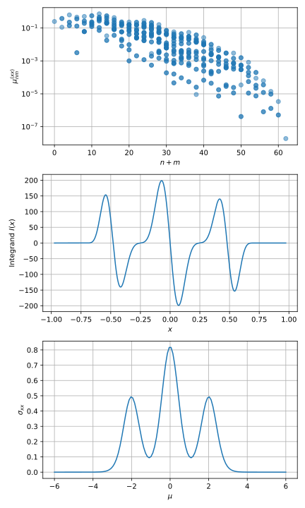

# Chebyshev recursion for conductivity

Implementation of conductivity tensor calculation
using Chebyshev moment evaluation.

Comparing with conductivity from finite differences
in the applied vector potential.

Garcia, Covaci, Rappoport, PRL 114, 116602 (2015)
https://doi.org/10.1103/PhysRevLett.114.116602

